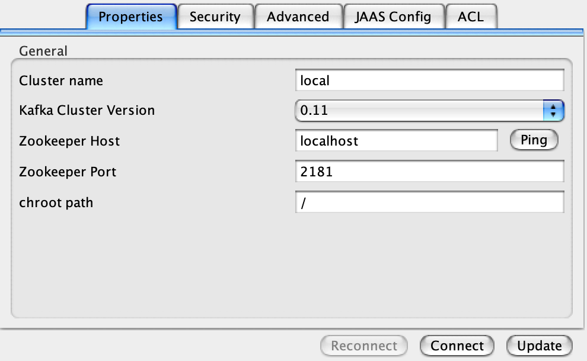
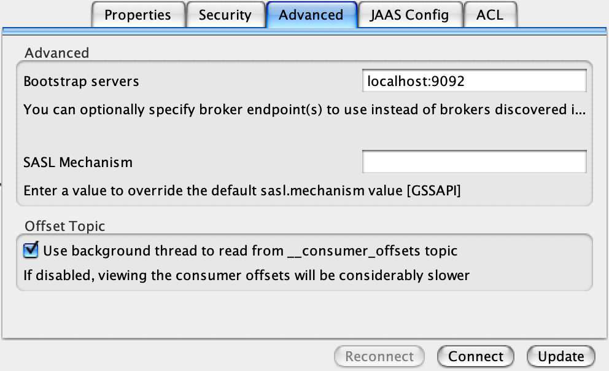
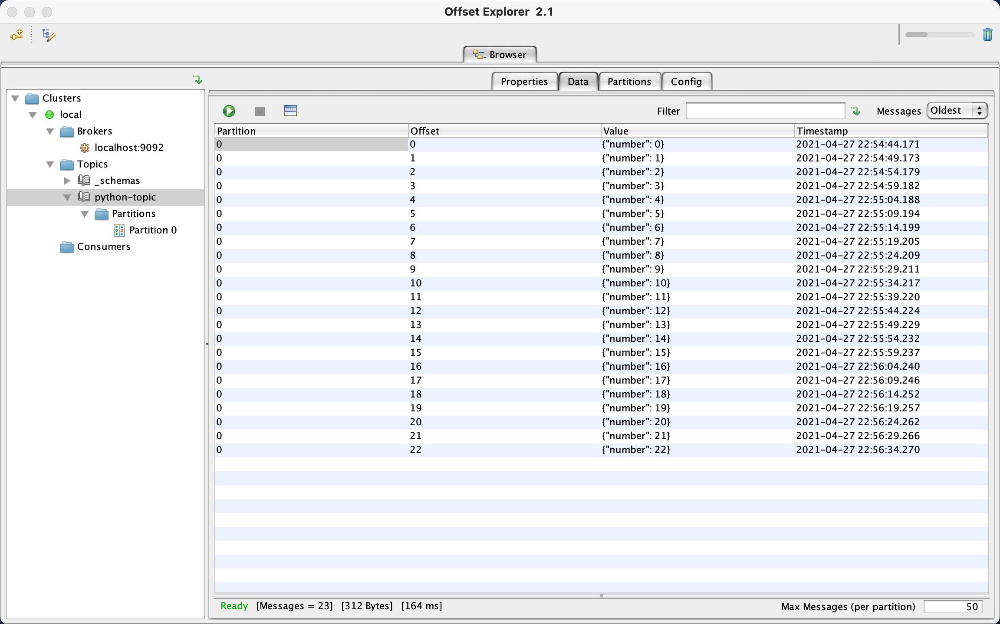

# 💬 Apache Kafka
By Anthony Vilarim Caliani


This is my Apache Kafka repository. Here you will find some stuff that I've done while I was learning about how to work with Apache Kafka.

## Quick Start
```bash
# Create Kafka and Zookeper containers
docker-compose up -d

# Checking if everything is okay
docker-compose ps

# Checking Zookeper
docker-compose logs zookeeper | grep -i binding

# Checking Kafka (It may take a few seconds to start)
docker-compose logs kafka | grep -i started
```

### Creating Topic
```bash
./kafka.sh --create   "sales-topic"
./kafka.sh --describe "sales-topic"

# Optional! 
./kafka.sh --test-pub "sales-topic"
./kafka.sh --test-sub "sales-topic"
```

## Kafka Tool








### Related Links
- [Kafka Tool - UI Tool 4 Kafka](https://www.kafkatool.com/download.html)
- [Medium: Aprendendo na prática](https://medium.com/trainingcenter/apache-kafka-codifica%C3%A7%C3%A3o-na-pratica-9c6a4142a08f)
- [Github: Confluent Inc. (Apache Kafka®)](https://github.com/confluentinc/cp-docker-images)

---

🧙‍♂️ _"If in doubt Meriadoc, always follow your nose." - Gandalf_
