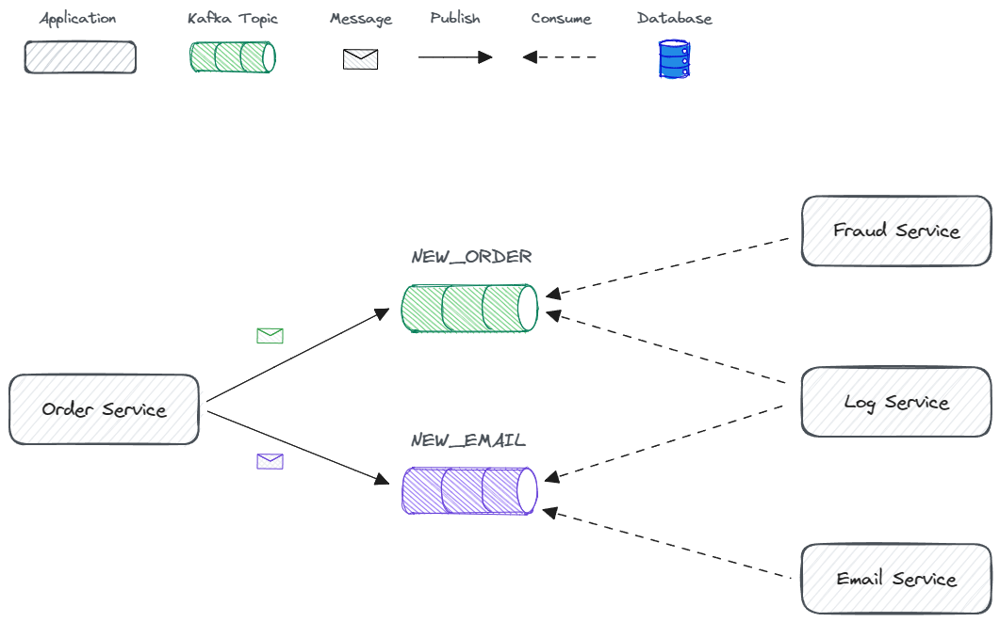

# 📫 Kafka App


During [Alura's Kafka] learning path, I developed some simple "e-commerce" modules in order to put into practice the Kafka learnings.

> 💡 It's important to mention the focus here is to learn about Kafka, which means that you won't find very complicated business logic, okay?

So, **let's navigate** in this project 🚣‍♂️

[Alura's Kafka]: https://www.alura.com.br/formacao-kafka

## Project Structure

In this project I'm using a "monorepo" structure with the following components...

```text
projects
├─ 🧠 kafka-core    : Module that contains all kafka common code and dependencies.
├─ 📦 order-service : Orders service.
├─ 🕵️‍♂️ fraud-service : Fraud detector service.
├─ 📧 email-service : Email Service.
└─ 📖 log-service   : Service responsible for logging every message that happens in the system.
```

Each component is a sub-project in this repository, also this structure enables us to isolate the modules, but also lets us reuse common code, which is what I did creating the `kafka-core`.

> **💡 Monorepo Inspiration**  
> To create this project structure I used the "[python-monorepo]" repository as a reference, which is an amazing repository with very clear and didactic examples.  
> I do recommend you to have a look at [@ya-mori]'s work.

[@ya-mori]: https://github.com/ya-mori
[python-monorepo]: https://github.com/ya-mori/python-monorepo/tree/master/sample_2

### Diagram



## How do I execute this project?

First of all, check the 👉 [Dev Setup](.docs/dev-setup.md) 👈 document.  
There you will find all the instructions to prepare your machine.

Having your setup ready, now you can execute each service 🚀

```bash
# Starting the services
poetry run python -m order_service.main

# WiP 🟡
```

<br/>

🧙‍♂️ _"If in doubt Meriadoc, always follow your nose." - Gandalf_
