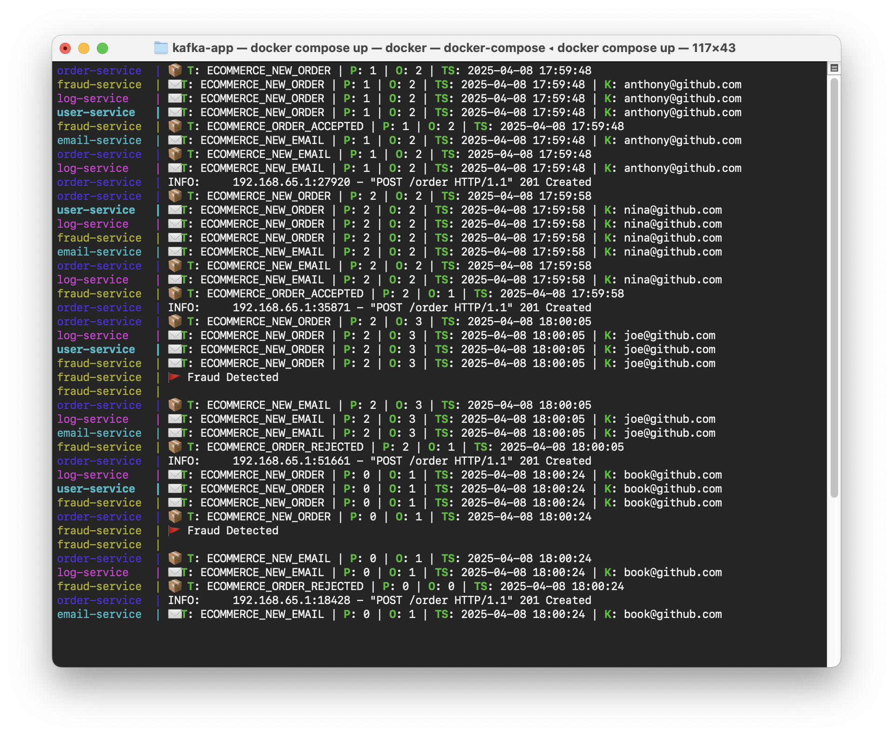

# 📫 Kafka App


During [Alura's Kafka] learning path, I developed some simple "e-commerce" modules in order to put into practice the Kafka learnings.

> 💡 It's important to mention the focus here is to learn about Kafka, which means that you won't find very complicated business logic, okay?

So, **let's navigate** in this project 🚣‍♂️

[Alura's Kafka]: https://www.alura.com.br/formacao-kafka

## Project Structure

In this project I'm using a "monorepo" structure with the following components...

```text
projects
├─ 🧠 kafka-core    : Module that contains all kafka common code and dependencies.
├─ 📦 order-service : Orders service.
├─ 🕵️‍♂️ fraud-service : Fraud detector service.
├─ 📧 email-service : Email service.
├─ 📖 log-service   : Service responsible for logging every message that happens in the system.
└─ ☃️ user-service  : User service, responsible for storing the users.
```

Each component is a sub-project in this repository, also this structure enables us to isolate the modules, but also lets us reuse common code, which is what I did creating the `kafka-core`.

> **💡 Monorepo Inspiration**  
> To create this project structure I used the "[python-monorepo]" repository as a reference, which is an amazing repository with very clear and didactic examples.  
> I do recommend you to have a look at [@ya-mori]'s work.

[@ya-mori]: https://github.com/ya-mori
[python-monorepo]: https://github.com/ya-mori/python-monorepo/tree/master/sample_2

### Diagram


> **💡 Note**  
> I did not create all the resources in the Alura Course, but I did the course until the end.  
> So I created a document containing the diagram with the rest of the architecture, new learnings and notes.  
> [Document](https://docs.google.com/document/d/1vsV_y37GA8BuNp7H-Rv1jyg7cki5o1MzUbXrL21ZO4I) at Google Docs 📘

## How do I execute this project?

You just need to execute the services 🚀

```bash
# Add the "-d" flag if you want to execute the services in background.
docker compose up
```

Then, to trigger the services, you have to do a HTTP POST request to the [order service](./projects/order-service/README.md).



To shutdown the services, you just need to execute...

```bash
docker compose down
```

> **Development Guide**  
> First of all, check the 👉 [Dev Setup](.docs/dev-setup.md) 👈 document.  
> There you will find all the instructions to prepare your machine.

<br/>

🧙‍♂️ _"If in doubt Meriadoc, always follow your nose." - Gandalf_
