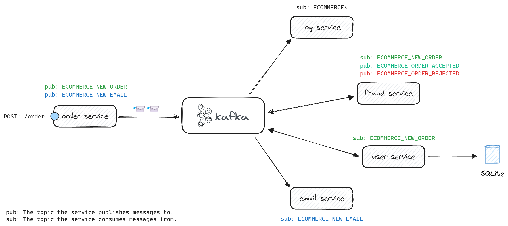

# 📫 Kafka App


This is my Apache Kafka repository.  
Here you will find some stuff that I've done while I was learning about how to work with Apache Kafka.

You can find all the exeperiments I've done through the **repository tags**.  

| tag    | description |
|--------|-------------|
| `v1.0` | PoCs that produce and consume data from Kafka, they were developed with Spring Boot, PySpark and Python. |
| `v2.0` | Some simple "e-commerce" modules that I've created while doing a Kafka course from Alura. |

The `master` branch will have the most recent code that I've created, to check more details of a past development checkout the specific tag you want.

## The Project

During the Alura Kafka trail courses, I developed some simple "e-commerce" modules in order to put in practice the Kafka learnings.  
Okay, let's go through the project components...

- **New Order Service**  
This is the producer and it is responsible for creating the new orders.
- **Fraud Detector Service**  
This consumer is responsible for fraud detection in new orders.
- **e-Mail Service**  
This consumer is responsible for sending an e-mail to the customers.
- **Log Service**  
This consumer is responsible for logging all the messages that were sent through all the topics.

> 💡 It's important to mention the focus here is to learn about Kafka, okay?

Here it is the project diagram, with all the components connecting to each other.



## Quick Start

To execute the services here you will need a Kafka instance up and running, let's up a Kafka node.

### Environment

In this section we are going to up a local Kafka.

```bash
# Build & Up
docker-compose build && docker-compose up -d

# Shutting Down
docker-compose down
```

**Do you want to test this Kafka via CLI?**  
I created [this document](kafka/README.md) with some nice commands for you to try 🤓

### Build & Run

Now, let's see how to prepare your development environment.

```bash
# Optional Step
pyenv local 3.10.6

# 🐍 Python VEnv
python3 -m venv .venv \
    && source .venv/bin/activate \
    && pip install --upgrade pip

# TODO: Split Services and Add Poetry
# TODO: Create Makefile
# TODO: Remove Inner README.
```

## Useful Links

- [Apache Kafka](https://kafka.apache.org/downloads)
- [Kafka Tool - UI Tool 4 Kafka](https://www.kafkatool.com/download.html)
- [Medium: Aprendendo na prática](https://medium.com/trainingcenter/apache-kafka-codifica%C3%A7%C3%A3o-na-pratica-9c6a4142a08f)

<br/>

🧙‍♂️ _"If in doubt Meriadoc, always follow your nose." - Gandalf_
